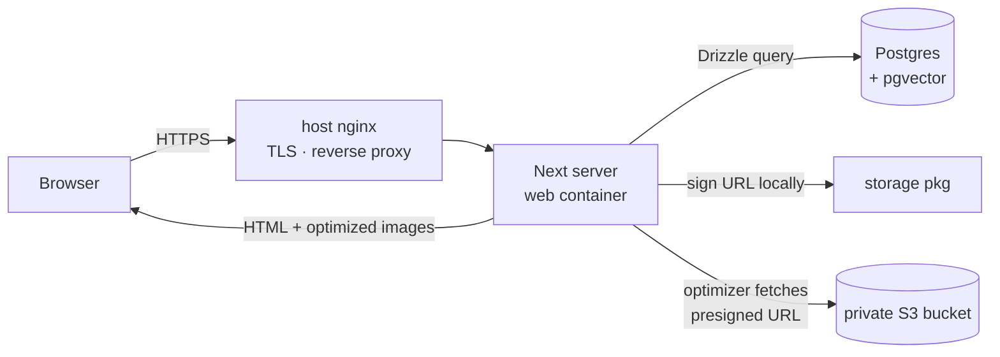
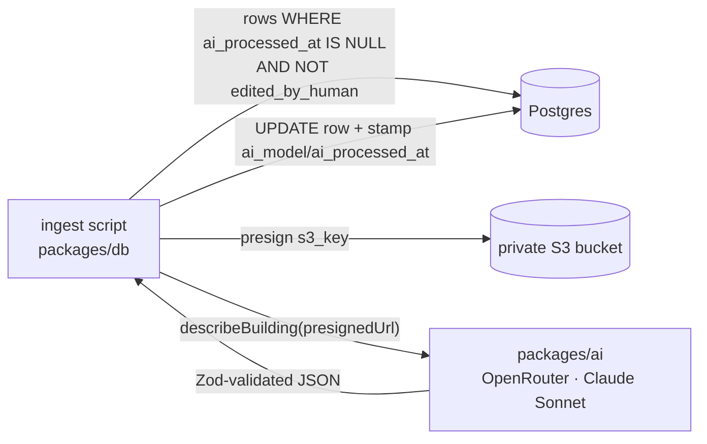
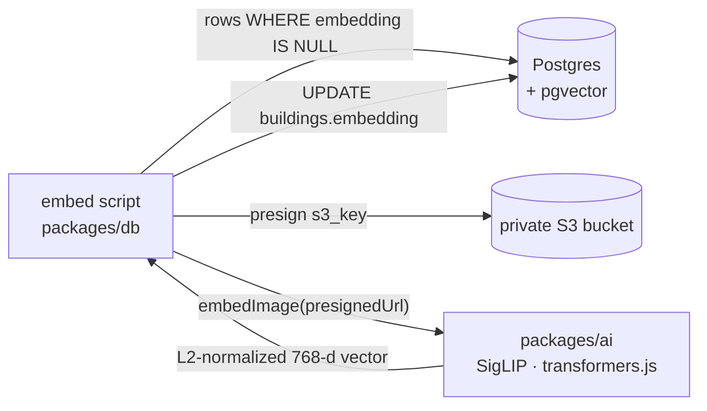
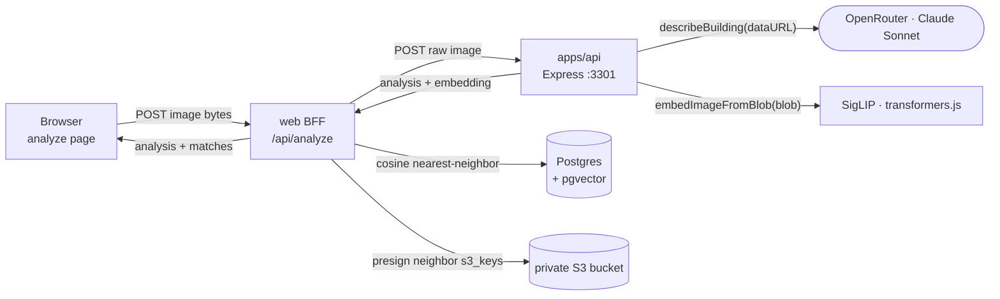
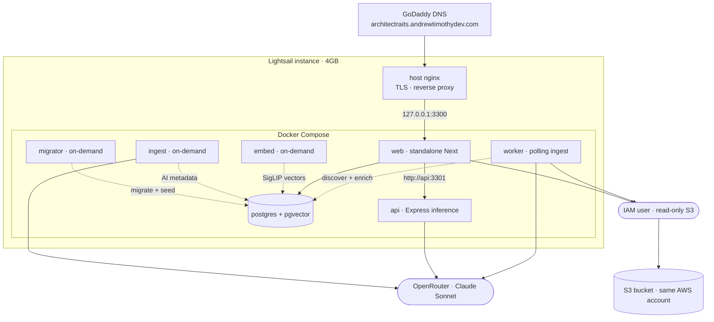

# ArchitectrAIts

A traditional-architecture exploration platform. Browse and search a curated catalog of fine traditional architecture, or upload a photo of any building to get an AI-generated analysis and matches against the catalog.

**Status:** Live in production on a Lightsail VPS. The browsable catalog, AI vision metadata, image-embedding similarity ("related buildings"), visitor upload-and-analyze, and the auto-enriching ingest worker are all built and running.

---

## Architecture

A pnpm monorepo. Three apps run today: `apps/web` (the Next.js UI + BFF), `apps/api` (an Express inference service for the upload-and-analyze feature), and `apps/worker` (a long-running poller that keeps the catalog enriched). The `packages/*` are consumed as workspace dependencies and **transpiled directly by Next.js** (no separate build step). The AI ingest, embedding, and dHash steps run continuously in `apps/worker`, and the same idempotent steps are also exposed as one-off scripts in `packages/db` for bulk backfill.

```
portfolioProject/
├── apps/
│   ├── web/        Next.js 16 App Router (RSC) — landing, catalog (paginated), building detail, analyze UI, /api/analyze BFF  :3300
│   ├── api/        Express — POST /analyze inference service (vision + embedding) for upload-and-analyze            :3301
│   └── worker/     polling ingest worker — discovers + enriches new S3 objects (database-as-queue)
├── packages/
│   ├── db/         Drizzle ORM + postgres.js — schema, migrations, seed + ingest scripts
│   ├── storage/    AWS S3 wrapper — listCatalogObjects, getPresignedImageUrl
│   ├── ai/         OpenRouter vision — describeBuilding (Claude Sonnet) + local SigLIP embeddings — embedImage / embedImageFromBlob
│   └── shared/     shared types/utils + perceptual-hash helpers
└── infra/         docker (dev + prod compose), nginx server block, env templates
```

### Data model

- **`buildings`** — `id`, `title`, `slug` (the URL key), `source_url`, `license`, `edited_by_human`, plus AI-populated metadata: `era`, `primary_style`, `year_built_estimate`, `description`, `ai_model`, `ai_processed_at`, and the `embedding` column. The vision step fills `era`/`primary_style`/`year_built_estimate`/`description`; `ai_processed_at` is null until a row is processed (the ingest idempotency key), and `edited_by_human` marks rows a human has corrected (so re-ingest skips them).
- **`buildings.embedding`** — a `vector(768)` (pgvector) holding the L2-normalized SigLIP image embedding, with an **HNSW index** (`vector_cosine_ops`) for fast nearest-neighbor search. `null` until the embed step runs (the embed idempotency key). Powers the "Related buildings" grid on the detail page via cosine distance (`<=>`).
- **`images`** — `id`, `building_id` (FK → `buildings`), `s3_key`, `width`, `height`.

Images live in a **private S3 bucket**; the app mints short-lived **presigned URLs** on demand rather than exposing objects publicly.

### Request flow



1. Browser hits the host's nginx over HTTPS; nginx reverse-proxies to the Next server.
2. A Server Component queries Postgres (`buildings` ⋈ `images`) via Drizzle.
3. Each `s3_key` is presigned into a temporary signed URL (SigV4, computed locally — no network round-trip).
4. `next/image`'s optimizer fetches that URL server-side, converts to WebP, and serves it.
5. AWS credentials and the DB connection never reach the browser.

The catalog (`apps/web/app/catalog/page.tsx`) and detail page (`apps/web/app/buildings/[slug]/page.tsx`) are both `force-dynamic` so they query live on each request; the catalog is **paginated** (8 per page, newest first, driven by a `?page=` query param, so only the current page's `s3_key`s are presigned/loaded). The landing page (`apps/web/app/page.tsx`) is a static hero (a CC0 Bellotto painting) that links into the catalog and analyze flows. The detail page sets a per-building `<title>` via `generateMetadata`, renders the AI `description`, and shows a **"Related buildings"** grid by ordering the catalog by cosine distance (`embedding <=> $current`) against the current building's embedding.

### AI ingest pipeline

Vision metadata is generated by idempotent steps (in `packages/db/src/jobs.ts`) shared by the long-running `apps/worker` poller and the one-off `packages/db` backfill scripts.



1. `packages/db/scripts/ingest.ts` selects buildings ⋈ images where `ai_processed_at IS NULL` and `edited_by_human = false`.
2. For each row (sequentially, with a small delay and per-row try/catch), it presigns the image and calls `describeBuilding(url)` in `packages/ai`.
3. `describeBuilding` sends a text+image message to **Claude Sonnet via OpenRouter** (OpenAI-compatible SDK pointed at `https://openrouter.ai/api/v1`), requests JSON-only output, and validates it with **Zod** (`primaryStyle`, `era`, `yearBuiltEstimate` nullable, `description`).
4. The row is updated and stamped with `ai_model` + `ai_processed_at`. Because the filter keys off `ai_processed_at`, re-runs only pick up unprocessed/failed rows, and human-corrected rows are never overwritten.

Model is configured via `OPENROUTER_VISION_MODEL` (`anthropic/claude-sonnet-4.6`) with the key in `OPENROUTER_API_KEY`.

### Image embedding pipeline

Embeddings are computed **locally on CPU** (no external API) by a one-off, idempotent script, mirroring the ingest shape.



1. `packages/db/scripts/embed.ts` selects buildings ⋈ images where `embedding IS NULL` (the idempotency key), so re-runs only pick up new/failed rows.
2. For each row it presigns the image and calls `embedImage(url)` in `packages/ai`.
3. `embedImage` runs **SigLIP** (`Xenova/siglip-base-patch16-224`) via `@huggingface/transformers` (ONNX Runtime, CPU). It reads the image, takes the model's `pooler_output` (`[1, 768]`), and **L2-normalizes** it so cosine distance is meaningful.
4. The vector is written to `buildings.embedding`, where the HNSW index makes the detail page's nearest-neighbor query fast.

The model files (~350MB) are downloaded on first run and cached. **transformers.js does not honor `HF_HOME`** (that's the Python library); the cache dir is set explicitly via `env.cacheDir` from the `HF_CACHE_DIR` env var, which in prod points at a Docker named volume (`hf_cache`) so the model isn't re-downloaded on every run. On the memory-constrained box the model can be loaded quantized (`{ dtype: 'q8' }`) to cut RAM and download size.

### Visitor upload-and-analyze

A visitor uploads a photo of any building; the app returns an AI analysis plus the nearest matches in the catalog. Unlike the gallery/detail pages (pure Server Components), this is a request-time inference path, so it's split across a **web BFF route** and a separate **`apps/api` inference service**.



1. The client (`apps/web/app/analyze/page.tsx`) sends the raw file to the web BFF at `apps/web/app/api/analyze/route.ts` with the file's `content-type`. The BFF rejects anything that isn't `image/*` with a `400`.
2. The BFF forwards the raw bytes to the inference service at `${ANALYZE_API_URL}/analyze`. If that call fails it returns a `502`.
3. `apps/api` (`POST /analyze`) reads the body via `express.raw({ type: 'image/*', limit: '8mb' })`, validates it's a non-empty image, then runs `describeBuilding` (OpenRouter vision) and `embedImageFromBlob` (local SigLIP) **in parallel** and replies `{ analysis, embedding }`. It's **stateless** — no DB, no S3 — so it can scale independently of the web app.
4. The BFF takes the returned `embedding`, runs a pgvector nearest-neighbor query (`embedding <=> $vec`, ordered ascending, `LIMIT 6`, skipping rows where `embedding IS NULL`), presigns each neighbor's `s3_key`, and returns `{ analysis, matches }`.
5. `AnalysisResults.tsx` renders the analysis (style, era, year, description) and the closest-match grid, each linking to its catalog detail page.

`embedImageFromBlob(blob)` shares the same pooling + L2-normalize path as `embedImage(url)` (both call the internal `embedRawImage`), so an uploaded photo and a catalog image land in the **same embedding space** — that's what makes "upload a known catalog photo → its own row is the top match" hold. The vision and embedding env requirements match the ingest/embed pipelines: `OPENROUTER_API_KEY` + `OPENROUTER_VISION_MODEL` for `describeBuilding`, and `HF_CACHE_DIR` for the SigLIP cache.

### Deployment topology

All on AWS: a single Lightsail instance running Docker Compose, reading from an S3 bucket in the same account.



- The Compose stack is `web` + `api` + `worker` + `postgres`, plus on-demand `tools`-profile services: `migrator` (migrate + seed), `ingest` (AI vision metadata), `embed` (local SigLIP image embeddings, with the model cached in the `hf_cache` named volume), and `dhash` (perceptual-hash dedup). The `web` container is published on `127.0.0.1:3300` only.
- **`api` is the upload-and-analyze inference service** — internal only (no published ports; `web` reaches it at `http://api:3301` over the compose network). It runs via `tsx` from the build image (so `onnxruntime-node`'s native binary isn't bundled into a compiled artifact) and shares the `hf_cache` volume, so the SigLIP model it loads on the first upload is the same one the `embed` tool populated. It holds the ~350MB model resident once loaded.
- **`worker` is the long-running ingest poller** — internal only (no published ports). On an interval (`WORKER_POLL_INTERVAL_MS`, default 60s) it lists the S3 bucket, inserts skeleton rows for any new objects, then fills in descriptions, embeddings, and dHashes. **The database is the queue:** each step keys off a nullable column (`ai_processed_at` / `embedding` / `dhash` IS NULL), so it needs no broker and a failed item is simply retried next tick — which is why there is no Redis. It loads its own copy of the SigLIP model (sharing the `hf_cache` volume with `api`), so the two hold ~350MB each resident.
- The box runs the **4GB Lightsail plan** with **4GB swap** retained from the original 2GB box; without swap, `next build` and concurrent containers had OOM-killed the Next server on the smaller box. Swap remains the safety valve under memory spikes (e.g. a rebuild while `api` + `worker` both hold the model).
- **TLS/ingress is the host's existing nginx** (shared with other sites on the box); a server block reverse-proxies the subdomain to the web container, with the cert issued via certbot (see `infra/nginx/architectraits.conf`).
- The `web` image is a **standalone** Next build (multi-stage from the monorepo; no `node_modules` at runtime).
- AWS access is a **least-privilege IAM user** scoped read-only to the one bucket; keys live in `infra/docker/.env.prod` on the box (gitignored).

---

## Development

Prerequisites: Node 22+, pnpm 10+, Docker.

```bash
pnpm install
pnpm db:up   # Postgres (pgvector) in Docker
pnpm dev     # web :3300 + api :3301 + worker, in parallel
```

Each app reads its own env file — `apps/web/.env.local`, `apps/api/.env`, and `apps/worker/.env` (see each app's `.env.example`). Broadly: `DATABASE_URL`, `S3_BUCKET`, `AWS_REGION` everywhere; `OPENROUTER_API_KEY` + `OPENROUTER_VISION_MODEL` wherever vision runs; `ANALYZE_API_URL=http://localhost:3301` for the web BFF. AWS credentials come from `~/.aws` via the default credential chain.

Database + ingest tasks live in `packages/db` (needs `packages/db/.env`):

```bash
pnpm --filter architectraits-db migrate   # apply migrations
pnpm --filter architectraits-db seed       # (re)build the catalog from S3 keys
pnpm --filter architectraits-db ingest     # AI vision metadata (idempotent)
pnpm --filter architectraits-db embed      # local SigLIP embeddings (idempotent)
```

> **WSL2:** keep the repo on the Linux-native filesystem (`~/...`), not `/mnt/c` — dev compiles and installs are far slower across the Windows mount.

---

## Deployment (Lightsail)

On the instance, with `infra/docker/.env.prod` filled in (`POSTGRES_PASSWORD`, IAM keys, and `OPENROUTER_API_KEY` + `OPENROUTER_VISION_MODEL`, shared by the `ingest` tool and the `api` service):

```bash
# build + start the stack: web (127.0.0.1:3300) + api (internal :3301) + worker + postgres
docker compose -f infra/docker/docker-compose.prod.yml --env-file infra/docker/.env.prod up -d --build

# one-off migrate + seed (rebuilds the buildings table from S3)
docker compose -f infra/docker/docker-compose.prod.yml --env-file infra/docker/.env.prod --profile tools run --build --rm migrator

# one-off AI ingest — run AFTER migrator, once OPENROUTER_API_KEY is set
docker compose -f infra/docker/docker-compose.prod.yml --env-file infra/docker/.env.prod --profile tools run --build --rm ingest

# one-off image embeddings — run AFTER migrator; CPU-only, no API key needed.
# First run downloads the SigLIP model into the hf_cache volume (~350MB); re-runs reuse it.
docker compose -f infra/docker/docker-compose.prod.yml --env-file infra/docker/.env.prod --profile tools run --build --rm embed
```

> The `tools` services build from current source; pass `--build` so a code change (e.g. a new migration) isn't missed by a stale image. `seed` wipes + rebuilds `buildings`, so prod gets fresh AI output — local hand-corrections don't transfer through a re-seed. A re-seed nulls `embedding` too, so re-run `embed` (and `ingest`) after any re-seed.

TLS/ingress is handled by the host's nginx reverse-proxying the subdomain to the web container (`infra/nginx/architectraits.conf`), with the cert issued via certbot.

---

## What's built

The full platform is shipped and running:

- **Catalog** — browsable, paginated gallery of the curated collection, with per-building detail pages.
- **AI vision metadata** — style, era, year, and description via Claude Sonnet on OpenRouter.
- **Image-embedding similarity** — local SigLIP embeddings in pgvector, powering the "related buildings" grid on detail pages.
- **Visitor upload-and-analyze** — upload a building photo → AI analysis → nearest catalog matches, via the `apps/api` inference service behind the web BFF.
- **Ingest worker** — `apps/worker`, a long-running poller that auto-discovers and enriches new S3 objects using the database as its work queue (no broker, no Redis).
- **`packages/imgcore-node` / `imgcore-wasm`** — a C++ image-processing core (perceptual hashing) built as both a Node N-API addon and a WebAssembly module from one CMake source tree.

## Possible future work

- **`apps/admin`** — internal admin for editing AI-tagged entries.
- **imgcore** — dominant-color and gradient feature vectors on top of the existing perceptual hashing.

## License

(TBD)
