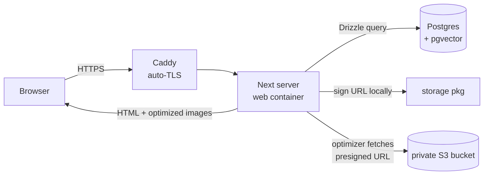
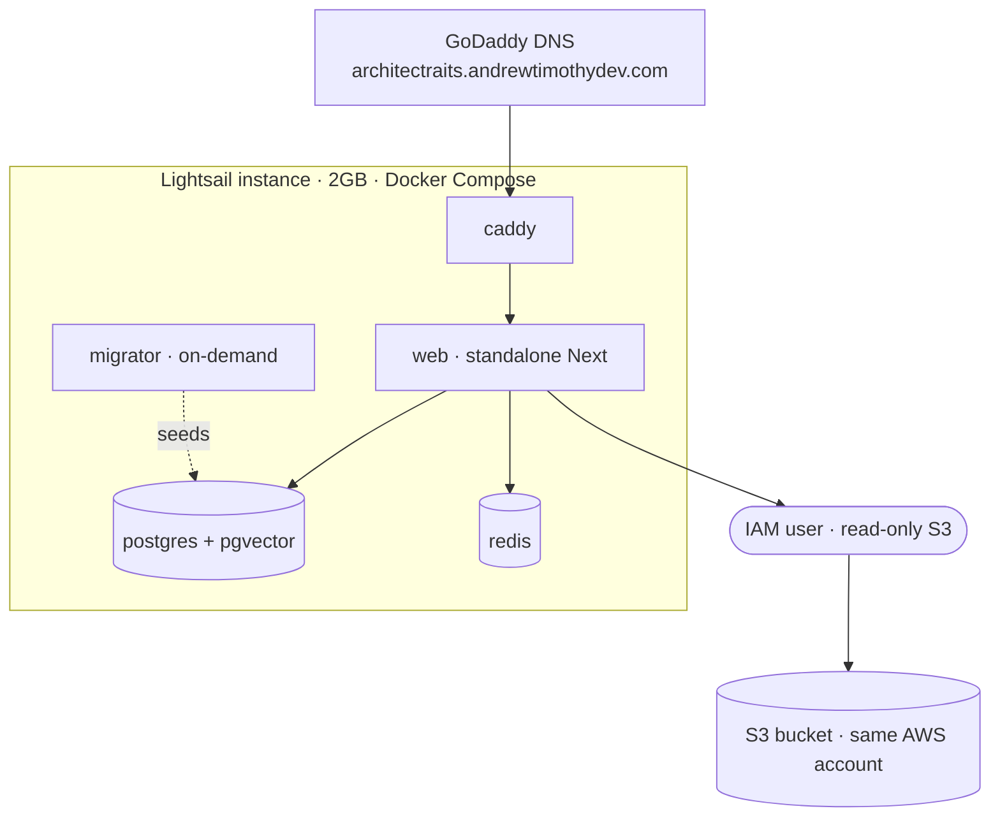

# ArchitectrAIts

A traditional-architecture exploration platform. Browse and search a curated catalog of fine traditional architecture, or upload a photo of any building to get an AI-generated analysis and matches against the catalog.

**Status:** Phase 1 complete (catalog gallery, live on a Lightsail VPS). Phase 2 (AI ingest pipeline) is next.

---

## Current architecture (Phase 1)

A pnpm monorepo. `apps/web` is the only running app today; the `packages/*` are consumed as workspace dependencies and **transpiled directly by Next.js** (no separate build step).

```
portfolioProject/
├── apps/
│   ├── web/        Next.js 16 App Router (React Server Components) — gallery + detail UI  :3300
│   └── api/        Express — scaffolded, not used yet                                     :3301
├── packages/
│   ├── db/         Drizzle ORM + postgres.js — schema, migrations, seed script
│   ├── storage/    AWS S3 wrapper — listCatalogObjects, getPresignedImageUrl
│   └── shared/     shared types/utils (minimal so far)
└── infra/docker/   dev + prod docker compose, Caddyfile, env templates
```

### Data model

- **`buildings`** — `id`, `title`, `slug` (the URL key), plus metadata that is mostly empty until Phase 2 fills it: `era`, `primary_style`, `year_built_estimate`, `source_url`, `license`, `edited_by_human`.
- **`images`** — `id`, `building_id` (FK → `buildings`), `s3_key`, `width`, `height`.

Images live in a **private S3 bucket**; the app mints short-lived **presigned URLs** on demand rather than exposing objects publicly.

### Request flow



1. Browser hits Caddy over HTTPS; Caddy reverse-proxies to the Next server.
2. A Server Component queries Postgres (`buildings` ⋈ `images`) via Drizzle.
3. Each `s3_key` is presigned into a temporary signed URL (SigV4, computed locally — no network round-trip).
4. `next/image`'s optimizer fetches that URL server-side, converts to WebP, and serves it.
5. AWS credentials and the DB connection never reach the browser.

The gallery (`apps/web/app/page.tsx`) and detail page (`apps/web/app/buildings/[slug]/page.tsx`) are both `force-dynamic` so they query live on each request.

### Deployment topology

All on AWS: a single Lightsail instance running Docker Compose, reading from an S3 bucket in the same account.



- One Compose stack: `caddy` → `web` → `postgres` + `redis`, plus an on-demand `migrator` for migrate + seed.
- The `web` image is a **standalone** Next build (multi-stage from the monorepo; no `node_modules` at runtime).
- AWS access is a **least-privilege IAM user** scoped read-only to the one bucket; keys live in `infra/docker/.env.prod` on the box (gitignored).
- Caddy obtains and renews TLS automatically via Let's Encrypt.

---

## Development

Prerequisites: Node 22+, pnpm 10+, Docker.

```bash
pnpm install
pnpm db:up          # Postgres (pgvector) + Redis in Docker
# create apps/web/.env.local with DATABASE_URL, S3_BUCKET, AWS_REGION
pnpm --filter web dev   # http://localhost:3300
```

Database tasks (in `packages/db`):

```bash
pnpm --filter architectraits-db generate   # create a migration from schema changes
pnpm --filter architectraits-db migrate     # apply migrations
pnpm --filter architectraits-db seed         # (re)build the catalog from S3 keys
```

AWS credentials for local dev are read from `~/.aws` via the default credential chain.

---

## Deployment (Lightsail)

On the instance, with `infra/docker/.env.prod` filled in (`POSTGRES_PASSWORD` + IAM keys):

```bash
# build + start the full stack
docker compose -f infra/docker/docker-compose.prod.yml --env-file infra/docker/.env.prod up -d --build

# one-off migrate + seed
docker compose -f infra/docker/docker-compose.prod.yml --env-file infra/docker/.env.prod --profile tools run --rm migrator
```

Then visit `https://architectraits.andrewtimothydev.com`.

> Slugs are derived from S3 filenames at seed time, so rename objects in the bucket **before** seeding a public deployment — slugs become permalinks once shared.

---

## Target vision (beyond Phase 1)

The longer-term plan the project is building toward:

- **`apps/worker`** — long-running ingest worker that processes new S3 objects.
- **`apps/admin`** — internal admin for editing AI-tagged entries.
- **`packages/imgcore-node` / `imgcore-wasm`** — a C++ image-processing core (perceptual hashing, dominant color, gradient feature vectors) built as both a Node N-API addon and a WebAssembly module from one CMake source tree.
- **AI:** open-source LLMs via Together.ai / OpenRouter — Qwen VL for vision, an open chat model, SigLIP/OpenCLIP for embeddings (stored in `pgvector`).
- **Visitor upload-and-analyze:** upload a building photo → AI analysis → nearest matches in the catalog.

## License

(TBD)
