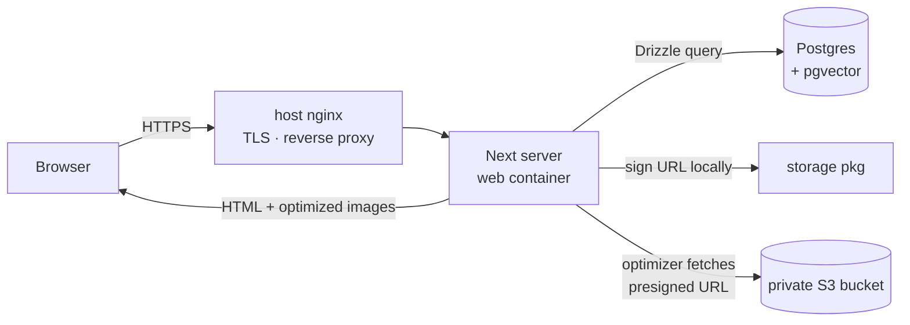
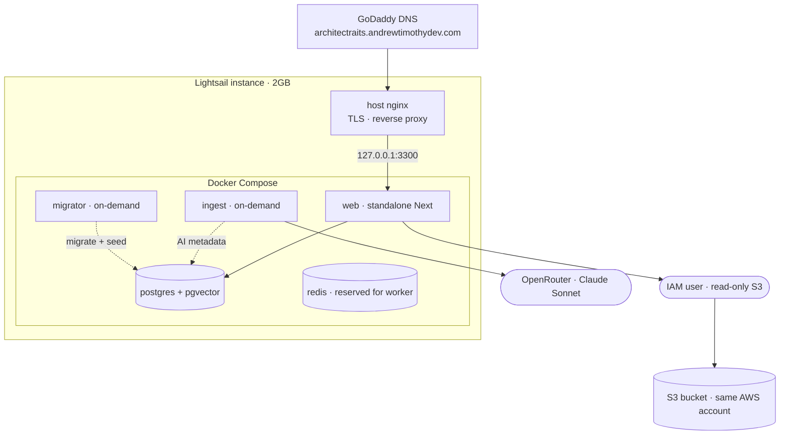

# ArchitectrAIts

A traditional-architecture exploration platform. Browse and search a curated catalog of fine traditional architecture, or upload a photo of any building to get an AI-generated analysis and matches against the catalog.

**Status:** Phase 1 (catalog gallery) and Phase 2a (AI vision metadata) complete and live on a Lightsail VPS. Phase 2b (image embeddings + similarity) is next.

---

## Current architecture (Phase 1 + 2a)

A pnpm monorepo. `apps/web` is the only running app today; the `packages/*` are consumed as workspace dependencies and **transpiled directly by Next.js** (no separate build step). The AI ingest runs as a one-off script in `packages/db` (the long-term Redis worker is still future work).

```
portfolioProject/
├── apps/
│   ├── web/        Next.js 16 App Router (React Server Components) — gallery + detail UI  :3300
│   └── api/        Express — scaffolded, not used yet                                     :3301
├── packages/
│   ├── db/         Drizzle ORM + postgres.js — schema, migrations, seed + ingest scripts
│   ├── storage/    AWS S3 wrapper — listCatalogObjects, getPresignedImageUrl
│   ├── ai/         OpenRouter vision client — describeBuilding (Claude Sonnet, Zod-validated JSON)
│   └── shared/     shared types/utils (minimal so far)
└── infra/         docker (dev + prod compose), nginx server block, env templates
```

### Data model

- **`buildings`** — `id`, `title`, `slug` (the URL key), `source_url`, `license`, `edited_by_human`, plus AI-populated metadata: `era`, `primary_style`, `year_built_estimate`, `description`, `ai_model`, `ai_processed_at`. Phase 2a fills `era`/`primary_style`/`year_built_estimate`/`description`; `ai_processed_at` is null until a row is processed (the ingest idempotency key), and `edited_by_human` marks rows a human has corrected (so re-ingest skips them).
- **`images`** — `id`, `building_id` (FK → `buildings`), `s3_key`, `width`, `height`.

Images live in a **private S3 bucket**; the app mints short-lived **presigned URLs** on demand rather than exposing objects publicly.

### Request flow



1. Browser hits the host's nginx over HTTPS; nginx reverse-proxies to the Next server.
2. A Server Component queries Postgres (`buildings` ⋈ `images`) via Drizzle.
3. Each `s3_key` is presigned into a temporary signed URL (SigV4, computed locally — no network round-trip).
4. `next/image`'s optimizer fetches that URL server-side, converts to WebP, and serves it.
5. AWS credentials and the DB connection never reach the browser.

The gallery (`apps/web/app/page.tsx`) and detail page (`apps/web/app/buildings/[slug]/page.tsx`) are both `force-dynamic` so they query live on each request. The detail page sets a per-building `<title>` via `generateMetadata` and renders the AI `description`.

### AI ingest pipeline (Phase 2a)

Vision metadata is generated by a one-off, idempotent script rather than a worker (the worker is the long-term shape).

```mermaid
flowchart LR
    I[ingest script<br/>packages/db] -->|rows WHERE ai_processed_at IS NULL<br/>AND NOT edited_by_human| P[(Postgres)]
    I -->|presign s3_key| S3[(private S3 bucket)]
    I -->|describeBuilding\(presignedUrl\)| AI[packages/ai<br/>OpenRouter · Claude Sonnet]
    AI -->|Zod-validated JSON| I
    I -->|UPDATE row + stamp ai_model/ai_processed_at| P
```

1. `packages/db/scripts/ingest.ts` selects buildings ⋈ images where `ai_processed_at IS NULL` and `edited_by_human = false`.
2. For each row (sequentially, with a small delay and per-row try/catch), it presigns the image and calls `describeBuilding(url)` in `packages/ai`.
3. `describeBuilding` sends a text+image message to **Claude Sonnet via OpenRouter** (OpenAI-compatible SDK pointed at `https://openrouter.ai/api/v1`), requests JSON-only output, and validates it with **Zod** (`primaryStyle`, `era`, `yearBuiltEstimate` nullable, `description`).
4. The row is updated and stamped with `ai_model` + `ai_processed_at`. Because the filter keys off `ai_processed_at`, re-runs only pick up unprocessed/failed rows, and human-corrected rows are never overwritten.

Model is configured via `OPENROUTER_VISION_MODEL` (`anthropic/claude-sonnet-4.6`) with the key in `OPENROUTER_API_KEY`.

### Deployment topology

All on AWS: a single Lightsail instance running Docker Compose, reading from an S3 bucket in the same account.



- The Compose stack is `web` + `postgres` + `redis`, plus on-demand `tools`-profile services: `migrator` (migrate + seed) and `ingest` (AI vision metadata). The `web` container is published on `127.0.0.1:3300` only.
- **`redis` is provisioned but not yet used** — it's reserved for the future ingest worker. Nothing connects to it today.
- The box has **4GB swap** added (Lightsail's 2GB plan ships with none); without it, `next build` and concurrent containers OOM-killed the Next server. Swap is the safety valve on this memory-constrained host.
- **TLS/ingress is the host's existing nginx** (shared with other sites on the box); a server block reverse-proxies the subdomain to the web container, with the cert issued via certbot (see `infra/nginx/architectraits.conf`).
- The `web` image is a **standalone** Next build (multi-stage from the monorepo; no `node_modules` at runtime).
- AWS access is a **least-privilege IAM user** scoped read-only to the one bucket; keys live in `infra/docker/.env.prod` on the box (gitignored).

---

## Development

Prerequisites: Node 22+, pnpm 10+, Docker.

```bash
pnpm install
pnpm db:up          # Postgres (pgvector) + Redis in Docker
# create apps/web/.env.local with DATABASE_URL, S3_BUCKET, AWS_REGION
pnpm --filter web dev   # http://localhost:3300
```

Database + ingest tasks (in `packages/db`; needs `packages/db/.env` with `DATABASE_URL`, `S3_BUCKET`, `AWS_REGION`, and for ingest `OPENROUTER_API_KEY` + `OPENROUTER_VISION_MODEL`):

```bash
pnpm --filter architectraits-db generate   # create a migration from schema changes
pnpm --filter architectraits-db migrate     # apply migrations
pnpm --filter architectraits-db seed         # (re)build the catalog from S3 keys
pnpm --filter architectraits-db ingest       # AI vision metadata (idempotent; only null/unedited rows)
pnpm --filter architectraits-db studio       # browse/edit the DB in Drizzle Studio
```

AWS credentials for local dev are read from `~/.aws` via the default credential chain.

> **WSL2 note:** keep the repo on the Linux-native filesystem (`~/...`), not `/mnt/c`. Next's dev compiles and `pnpm install` are dramatically slower across the Windows mount.

---

## Deployment (Lightsail)

On the instance, with `infra/docker/.env.prod` filled in (`POSTGRES_PASSWORD`, IAM keys, and `OPENROUTER_API_KEY` + `OPENROUTER_VISION_MODEL` for ingest):

```bash
# build + start the stack (web published on 127.0.0.1:3300)
docker compose -f infra/docker/docker-compose.prod.yml --env-file infra/docker/.env.prod up -d --build

# one-off migrate + seed (rebuilds the buildings table from S3)
docker compose -f infra/docker/docker-compose.prod.yml --env-file infra/docker/.env.prod --profile tools run --build --rm migrator

# one-off AI ingest — run AFTER migrator, once OPENROUTER_API_KEY is set
docker compose -f infra/docker/docker-compose.prod.yml --env-file infra/docker/.env.prod --profile tools run --build --rm ingest
```

> The `tools` services build from current source; pass `--build` so a code change (e.g. a new migration) isn't missed by a stale image. `seed` wipes + rebuilds `buildings`, so prod gets fresh AI output — local hand-corrections don't transfer through a re-seed.

Then wire it into the host's nginx and get a cert:

```bash
sudo cp infra/nginx/architectraits.conf /etc/nginx/sites-available/architectraits.andrewtimothydev.com
sudo ln -s /etc/nginx/sites-available/architectraits.andrewtimothydev.com /etc/nginx/sites-enabled/
sudo nginx -t && sudo systemctl reload nginx
sudo certbot --nginx -d architectraits.andrewtimothydev.com
```

Then visit `https://architectraits.andrewtimothydev.com`.

> Slugs are derived from S3 filenames at seed time, so rename objects in the bucket **before** seeding a public deployment — slugs become permalinks once shared.

---

## Target vision (beyond Phase 2a)

The longer-term plan the project is building toward:

- **Phase 2b — embeddings + similarity:** image embeddings (CLIP/SigLIP, likely transformers.js run locally), stored in a `pgvector` column, powering "related buildings" on detail pages.
- **`apps/worker`** — long-running ingest worker (Redis-backed) that processes new S3 objects, replacing the one-off ingest script.
- **`apps/admin`** — internal admin for editing AI-tagged entries.
- **`packages/imgcore-node` / `imgcore-wasm`** — a C++ image-processing core (perceptual hashing, dominant color, gradient feature vectors) built as both a Node N-API addon and a WebAssembly module from one CMake source tree.
- **Visitor upload-and-analyze:** upload a building photo → AI analysis → nearest matches in the catalog.

Done so far: **Phase 2a** — vision metadata (style, era, year, description) via Claude Sonnet on OpenRouter.

## License

(TBD)
